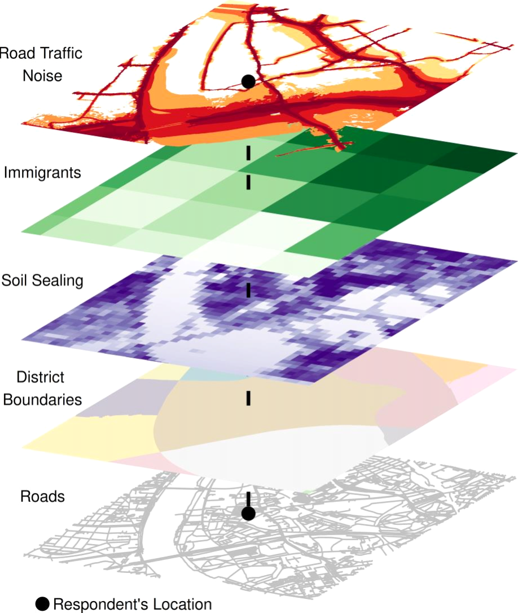

# Introduction

This course material is designed for the Summer Institute in Computational Social Science (SICSS) Oxford. The material provides a short introduction into the use of geographical information to connect and analyze different spatial data sources. This course provides a brief and dense introduction to the fundamentals of using geographical information in _R_. This field has developed very quickly over the past few years, and _R_ now provides a rich set of packages for various spatial data operations. For a more in-depth introduction into spatial data analysis in _R_, have a look into the materials references below. 

Why is spatial data linkage and analysis part of SICSS? The amount of spatial ('readymade') data sources is steadily increasing. For instance, the UK open data portal provides many indactors on a spatially agrregated level: https://data.gov.uk/. Moreover, geographical information is increasingly available for traditional ('custommade') data sources, such as survey data. Using geographic information allows us to:

* Link information from different (unrelated) data sources

* Incorporate a spatial dimension into the analysis

We can combine different sources of social science data, but we can also enrich existing social science data with information on aggregated demographics or other contextual information.

# Some useful packages

By now, _R_ provides a lot of functionalities for GIS applications and spatial econometrics, and further extensions. So, there are lots of packages not listed here [see e.g. @Bivand.2021]. The most important packages for fundamental spatial operations are:

* Spatial data workhorses: [sf](https://cran.r-project.org/web/packages/sf/index.html) [@Pebesma.2018] and [stars](https://cran.r-project.org/web/packages/stars/index.html) [@Pebesma.2021]

* Visualization: [mapview](https://cran.r-project.org/web/packages/mapview/index.html) [@Appelhans.2021] and [tmap](https://cran.r-project.org/web/packages/tmap/index.html) [@Tennekes.2018]

* Spatial weights and other relations: [spdep](https://cran.r-project.org/web/packages/stars/index.html) [@Bivand.2018]

* Spatial interpolation and kriging: [gstat](https://cran.r-project.org/web/packages/gstat/index.html) [@Graler.2016]

* Spatial regression models: [spatialreg](https://cran.r-project.org/web/packages/spatialreg/index.html) [@Bivand.2015.0] and [sphet](https://cran.r-project.org/web/packages/sphet/index.html) [@Bivand.2015.0]

# Further materials

Readings

* Great up-to-date introduction to spatial R: @Lovelace.2019, [updated version available online](https://geocompr.robinlovelace.net/)

* Another great introduction, but __not up-to-date__: @Bivand.2013.0. However, Edzer Pebesma and Roger Bivand are working on a new book on [Spatial Data Science](https://www.r-spatial.org/book)

* Comprehensive introduction to spatial econometrics: @LeSage.2009.0

* Two short introductions to spatial econometrics: @HalleckVega.2015.0 and @Ruttenauer.2019c

Course materials

* For those looking for a more in-depth introduction, I highly recommend Roger Bivand's course on Spatial Data Analysis: [Youtube recordings](https://www.youtube.com/watch?v=KkIbg50Pa0I&list=PLXUoTpMa_9s10NVk4dBQljNOaOXAOhcE0), [Course Materials](https://rsbivand.github.io/ECS530_h19/)

# References
